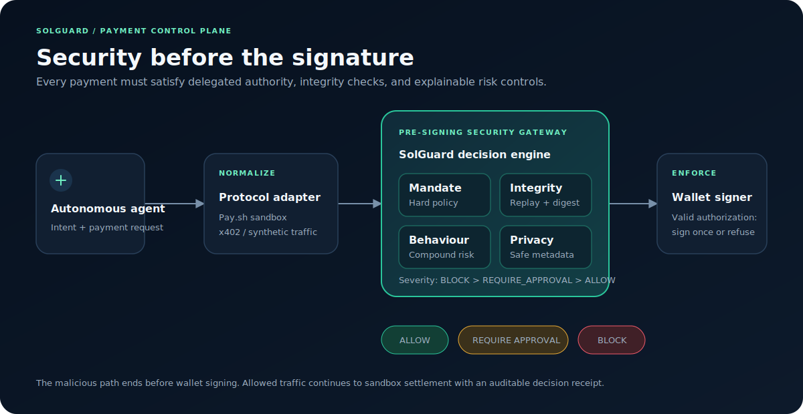
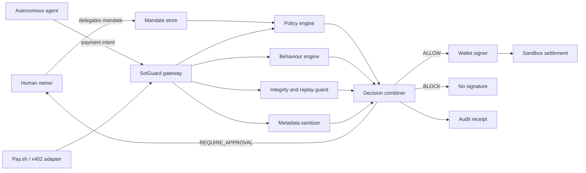

# SolGuard

> The pre-signing security gateway for autonomous agent payments.

[](#project-status)
[](#speed-build-2026)
[](docs/THREAT_MODEL.md)



Autonomous agents can discover services, negotiate prices, and initiate payments at machine speed. That also means a compromised agent can lose funds at machine speed. SolGuard sits between an agent and its wallet, evaluates every proposed payment against an owner-approved financial mandate, and returns a decision **before a signature is produced**.

```text
Agent intent -> Payment request -> SolGuard -> ALLOW / REQUIRE_APPROVAL / BLOCK -> Wallet
```

SolGuard is being developed for **Speed Build 2026**, whose scenario asks builders to secure financial infrastructure against a future autonomous-agent attack. The objective is a working, explainable demonstration—not a claim of production readiness.

## Why SolGuard

Payment protocols answer: **How can an agent pay?**

SolGuard answers: **Should this agent be allowed to make this payment?**

The initial prototype is designed to defend against:

- Wallet drain and abnormal overpayment
- Rapid payment bursts
- First-seen or prohibited recipients
- Payments outside a delegated budget or purpose
- Replayed or expired authorizations
- Sensitive information leaking through payment metadata
- Security-service failure, using fail-closed signing

## The core primitive: Agent Financial Mandates

A human authorizes a constrained mandate instead of approving every transaction:

```json
{
  "agent_id": "research-agent-01",
  "purpose": "Purchase verified research APIs",
  "asset": "USDC",
  "max_single_payment": "2.00",
  "allowed_recipients": ["weather-api", "market-data-api"],
  "blocked_recipients": ["attacker-wallet"],
  "valid_from": "2026-07-25T09:00:00Z",
  "expires_at": "2026-07-26T00:00:00Z"
}
```

Every proposed payment must match the mandate and pass behavioural checks. The mandate is intended to be deterministic and auditable; anomaly detection adds context but cannot override a hard owner policy.

## Decision model

| Decision | Meaning | Wallet behaviour |
|---|---|---|
| `ALLOW` | Request satisfies mandate and risk controls | Signing may continue |
| `REQUIRE_APPROVAL` | Request is plausible but outside learned behaviour | Pause for explicit approval |
| `BLOCK` | Hard policy, replay, integrity, or compound-risk violation | Do not sign |

The gateway returns machine-readable reason codes and a human-readable explanation for every decision.

## Architecture



Explore the planned flow in the [interactive architecture](docs/architecture.html), or read the detailed [architecture specification](docs/ARCHITECTURE.md).

## Demonstration

The target two-minute demonstration proves both safety and usability:

1. A legitimate agent purchases a low-cost API resource.
2. SolGuard validates the mandate and allows the sandbox payment.
3. The operator triggers a compromised-agent scenario.
4. The agent attempts a high-value burst toward a first-seen recipient.
5. SolGuard blocks the request before signing and shows exact reason codes.
6. The wallet balance remains unchanged.
7. A subsequent legitimate request still succeeds.

The judge-facing proof is not a dashboard alert. It is the absence of a wallet signature and settlement for the malicious request.

See the [demo and validation plan](docs/DEMO_PLAN.md).

## Planned repository layout

```text
SolGuard/
├── src/solguard/
│   ├── gateway/          # Request orchestration and fail-closed boundary
│   ├── mandates/         # Financial mandate validation
│   ├── detection/        # Behaviour and compound-risk rules
│   ├── integrity/        # Nonce, expiry, and replay protection
│   ├── privacy/          # Metadata sanitization
│   ├── adapters/         # Pay.sh, x402, and sandbox integrations
│   └── audit/            # Decision receipts and event history
├── dashboard/            # Live demonstration interface
├── tests/                # Unit, integration, attack, and failure tests
└── docs/                 # Architecture, threat model, and demo plan
```

## Security principles

1. **Pre-signing enforcement.** A post-settlement alert is too late.
2. **Fail closed.** If SolGuard cannot reach a trustworthy decision, the wallet does not sign.
3. **Hard policy outranks heuristics.** Behavioural scoring never bypasses a mandate.
4. **Explain every decision.** Each block includes stable reason codes and evidence.
5. **Learn only from approved traffic.** Blocked requests cannot poison an agent baseline.
6. **No custom cryptography.** Use established wallet and protocol primitives.
7. **Minimize sensitive data.** Sanitize metadata and avoid retaining secrets.
8. **Prove claims live.** Demo metrics must originate from the running gateway.

The detailed security boundaries, attacker assumptions, and non-goals are documented in [THREAT_MODEL.md](docs/THREAT_MODEL.md). Security reports should follow [SECURITY.md](SECURITY.md).

## Project status

**Current phase: Phase 4 external sandbox integration.**

The protocol-independent contracts, simple mandate policy, four documented detection rules, fail-closed gateway, deterministic simulated settlement, metadata sanitizer, live dashboard, chained local audit receipts, adversarial security scenarios, basic request-expiry and per-agent nonce replay protection, and one real Pay.sh sandbox path are implemented and covered by automated tests. Wallet-bound single-use authorization remains planned. Features are marked implemented only after they run successfully and pass the repository verification suite.

| Capability | Status |
|---|---|
| Architecture and threat model | Documented |
| Canonical payment contracts | Implemented and tested |
| Simple financial mandate engine | Implemented and tested |
| Pre-signing gateway | Implemented and tested |
| Request expiry and per-agent nonce replay protection | Implemented and tested |
| Four-rule behavioural detection | Implemented and tested |
| Deterministic simulated settlement | Implemented and tested |
| Metadata sanitizer | Implemented and tested |
| Pay.sh sandbox adapter | Implemented, tested, and exercised against the official sandbox |
| x402 adapter | Stretch goal |
| Live dashboard | Implemented and tested |
| Audit receipts and local event stream | Implemented and tested |
| Recorded fallback demo | Planned |

## Development setup

SolGuard requires Python 3.11–3.13 and uses [uv](https://docs.astral.sh/uv/) for locked dependency management.

Install all development dependencies from a fresh clone:

```bash
uv sync --locked --all-groups
```

Run the same verification commands enforced by continuous integration:

```bash
uv run ruff check .
uv run ruff format --check .
uv run mypy
uv run pytest
```

The committed `uv.lock` is authoritative. Dependency changes must update the lock file and pass the complete verification suite.

Run the local simulated security dashboard:

```bash
uv run solguard-dashboard
```

Open `http://127.0.0.1:8765`. The dashboard starts with an empty runtime state; use its normal-payment and compromised-agent controls to generate computed local events.

After installing the official Pay CLI, attempt one external ephemeral-wallet sandbox purchase through the same gateway:

```bash
uv run solguard-paysh
```

The Pay.sh path is optional. The local simulated dashboard remains the reliable fallback when the CLI or network is unavailable.

## Build order

1. Mandate schema and deterministic policy engine
2. Replay-safe pre-signing decision gateway
3. Behavioural and compound drain detection
4. Automated attack and fail-closed test suite
5. One real sandbox payment adapter
6. Live dashboard driven exclusively by gateway events
7. Backup recording and pitch rehearsal
8. Additional protocol adapters only after the core is reliable

## Business direction

SolGuard's proposed commercial wedge is usage-based transaction screening for agent platforms and wallets, with enterprise policy management and audit capabilities. Candidate design partners include agent-wallet providers, paid-API marketplaces, and organisations deploying autonomous purchasing agents.

This is an early product thesis, not evidence of existing customers, revenue, or production deployment.

## Documentation

- [System architecture](docs/ARCHITECTURE.md)
- [Interactive architecture](docs/architecture.html)
- [Threat model](docs/THREAT_MODEL.md)
- [Metadata sanitization](docs/PRIVACY.md)
- [Local security dashboard](docs/DASHBOARD.md)
- [Audit receipts and local event stream](docs/AUDIT.md)
- [Request integrity and replay protection](docs/INTEGRITY.md)
- [Pay.sh sandbox integration](docs/PAYSH.md)
- [Demo and validation plan](docs/DEMO_PLAN.md)
- [Security policy](SECURITY.md)
- [Contribution and release workflow](CONTRIBUTING.md)

## Speed Build 2026

SolGuard is an independent hackathon project for Speed Build 2026 in London, 25–26 July 2026. References to Pay.sh, x402, Solana, or CoralOS describe intended interoperability or planned experiments unless a test in this repository proves otherwise. No affiliation or endorsement is implied.

## Author

Created by [Tanvir Farhad (TFT444)](https://github.com/TFT444), founder of ShieldTech.

## License

SolGuard is available under the [MIT License](LICENSE). Copyright (c) 2026 ShieldTech Ltd.
